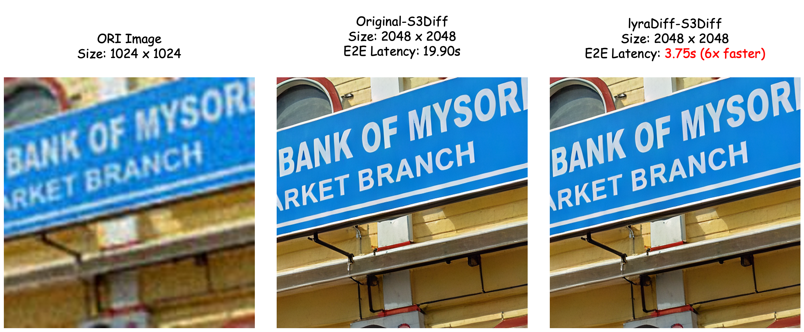

<div align="center">

<h1> lyraDiff: An Out-of-the-box Acceleration Engine for Diffusion and DiT Models</h1>

</div> 


`lyraDiff` introduces a **recompilation-free** inference engine for Diffusion and DiT models, achieving **state-of-the-art speed**, **extensive model support**, and **pixel-level image consistency**.

## Highlights
- **State-of-the-art Inference Speed**: `lyraDiff` utilizes multiple techniques to achieve up to **6.1x** speedup of the model inference, including **Quantization**, **Fused GEMM Kernels**, **Flash Attention**, and **NHWC & Fused GroupNorm**.
- **Memory Efficiency**: `lyraDiff` utilizes buffer-based DRAM reuse strategy and multiple types of quantizations (FP8/INT8/INT4) to save **10-40%** of DRAM usage.
- **Extensive Model Support**: `lyraDiff` supports a wide range of top Generative/SR models such as **SD1.5, SDXL, FLUX, S3Diff, etc.**, and those most commonly used plugins such as **LoRA, ControlNet and Ip-Adapter**.
- **Zero Compilation Deployment**: Unlike **TensorRT** or **AITemplate**, which takes minutes to compile, `lyraDiff` eliminates runtime recompilation overhead even with model inputs of dynamic shapes.
- **Image Gen Consistency**: The outputs of `lyraDiff` are aligned with the ones of [HF diffusers](https://github.com/huggingface/diffusers) at the pixel level, even under LoRA switch in quantization mode.
- **Fast Plugin Hot-swap**: `lyraDiff` provides **Super Fast Model Hot-swap for ControlNet and LoRA** which can hugely benefit a real-time image gen service.

## Overview



__NOTE__: 

1. We only support GPUs with SM version >= 80. For example, Nvidia Ampere architecture (A2, A10, A16, A30, A40, A100), Ada Lovelace architecture (L20, RTX 4090), Hopper architecture (H20, H100, H800) and etc.
2. The INT4 quantization is currently in the draft stage and has a lot of room for performance improvement.

## Performance
### Test environment
- **Nvidia driver version**: 535.161.07
- **Nvidia cuda version**: 12.4

### SDXL performance (Device: A100-40G, Dtype: int8)
We test our acceleration to [SDXL](https://huggingface.co/stabilityai/stable-diffusion-xl-base-1.0) on these commonly used image generation shapes. We use [HF diffusers](https://github.com/huggingface/diffusers) with `fp16` as baseline in comparison to lyraDiff with `INT8 SmoothQuant` quantization method, since `INT8 SmoothQuant` presents acceptable difference to original images on A100 and gives better performance.

| Image Size | Steps  | Time cost(s)       | Time cost(s) (lyra)  | Speed Up  |
|:----------:|:------:|:------------------:|:--------------------:|:---------:|
|  512x512   |   20   |       1.41         |        0.49          |   2.9x    |
|  768x768   |   20   |       1.53         |        0.89          |   1.7x    |
| 1024x1024  |   20   |       2.30         |        1.44          |   1.6x    |

### FLUX performance 
We test our acceleration to [FLUX.1-dev](https://huggingface.co/black-forest-labs/FLUX.1-dev) on these commonly used image generation shapes. We use [HF diffusers](https://github.com/huggingface/diffusers) with `bf16` as baseline in comparison to lyraDiff with `FP8` quantization method, since `FP8` presents almost no difference to original images on `L20 and 4090` and gives better performance.

#### Device: 4090-24G, Dtype: fp8

| Image Size | Steps  | Time cost(s)       | Time cost(s) (lyra)  | Speed Up |
|:----------:|:------:|:------------------:|:--------------------:|:--------:|
|  512x512   |   20   |       3.81         |        2.16          |   1.8x   |
|  768x768   |   20   |       7.55         |        4.13          |   1.8x   |
| 1024x1024  |   20   |      13.48         |        7.22          |   1.9x   |
| 1280x1280  |   20   |      22.77         |       13.14          |   1.7x   |

#### Device: L20-48G, Dtype: fp8

| Image Size | Steps  | Time cost(s)       | Time cost(s) (lyra)  | Speed Up |
|:----------:|:------:|:------------------:|:--------------------:|:--------:|
|  512x512   |   20   |       5.54         |        2.91          |   1.9x   |
|  768x768   |   20   |      10.22         |        5.64          |   1.8x   |
| 1024x1024  |   20   |      18.34         |       10.28          |   1.8x   |
| 1280x1280  |   20   |      31.47         |       17.64          |   1.8x   |


### S3Diff performance (Device: A10-24G, Dtype: fp16)
We test our acceleration to [S3Diff](https://github.com/ArcticHare105/S3Diff) on these commonly used image SR shapes. We use the original pipeline with `fp16` as baseline in comparison to lyraDiff on `A10`.

| Image Size | SR Ratio | Time cost(s) (ori) | Time cost(s) (lyra) | Speed Up     |
|:----------:|:--------:|:------------------:|:-------------------:|:------------:|
| 128x128    | 4        | 0.68               | 0.17                | 4.0x         |
| 512x512    | 2        | 2.10               | 0.86                | 2.4x         |
| 720x1280   | 2        | 16.64              | 3.36                | 4.9x         |
| 1024x1024  | 2        | 19.90              | 3.75                | 5.3x         |
| 1920x1080  | 2        | 42.24              | 6.91                | 6.1x         |

### Model swap performance (Device: A100-40G, Dtype: fp16)

| Model  | Plugin     | Time cost(s)       | Time cost(s) (lyra)  | Speed Up  |
|:------:|:----------:|:------------------:|:--------------------:|:---------:|
| SD1.5  |  LoRA      |       1.46         |        0.14          |   10.4x   |
| SD1.5  | ControlNet |       0.72         |        0.64          |   1.1x    |
| SDXL   |  LoRA      |       4.27         |        0.63          |   6.8x    |
| SDXL   | ControlNet |       2.08         |        0.99          |   2.1x    |

## Getting Started

### Method 1: Using Docker (Recommended)

You can use the docker image we provide `ccr.ccs.tencentyun.com/tme-lyralab/lyradiff_workspace:1.0.0`.
```shell
docker run --gpus all -it --rm --name lyraDiff_workspace ccr.ccs.tencentyun.com/tme-lyralab/lyradiff_workspace:1.0.0
# lyradiff python lib is installed and libth_lyradiff.so is located at /workspace/lyradiff_libs/libth_lyradiff.so where lyradiff will load by default
# You can export LYRA_LIB_PATH="/path/to/libth_lyradiff.so" to override the default setting

```

### Method 2: Build from source

Nvidia's standard NGC docker images are highly recommended.

For example, `nvcr.io/nvidia/pytorch:24.08-py3`.

```shell
docker run --gpus all -it --rm --name lyraDiff_workspace  nvcr.io/nvidia/pytorch:24.08-py3

cd </path/to/lyraDiff/workspace/>

# Step 1: Install lyradiff python lib
pip install -e .

# Step 2: Build libth_lyradiff.so
git submodule init && git submodule update  

mkdir build && cd build

# Please set the correct sm version
cmake -DSM=80 -DCXX_STD=17 -DBUILD_PYT=ON  -DCMAKE_BUILD_TYPE=Release -DBUILD_MULTI_GPU=ON ..

make -j16

# You will find libth_lyradiff.so in build/lib

# set LYRA_LIB_PATH to override default LYRA_LIB_PATH
export LYRA_LIB_PATH="/path/to/libth_lyradiff.so"

```

## Usage Example

In [examples](examples/), we provide minimal scripts for running diffusion models with lyraDiff. For example, the [script](examples/FLUX/flux_demo.py) for [FLUX.1-dev](https://huggingface.co/black-forest-labs/FLUX.1-dev) is as follows:

```python
import torch
from diffusers import FluxPipeline
import os
from lyradiff.lyradiff_model.lyradiff_flux_transformer_model_v2 import LyraDiffFluxTransformer2DModelV2
from lyradiff.lyradiff_model.lyradiff_utils import LyraQuantLevel

model_path = "/path/to/lyraDiff-FLUX.1-dev/"
quant_level = LyraQuantLevel.NONE
transformer_model = LyraDiffFluxTransformer2DModelV2(quant_level=quant_level)
transformer_model.load_from_diffusers_model(os.path.join(model_path, "transformer"))

model = FluxPipeline.from_pretrained(model_path, transformer=None, torch_dtype=torch.bfloat16).to("cuda")
model.transformer = transformer_model

# Image Gen
image = model("Female furry Pixie with text hello world",
    height=1024,
    width=1024,
    guidance_scale=3.5,
    num_inference_steps=20,
    max_sequence_length=512,
    generator=torch.Generator("cuda").manual_seed(123)
).images[0]
image.save("flux.1-dev.png")

```

To check examples for more supported models and more details, please refer to following README:

* [SD1.5](examples/SD1.5/README.md)
* [SDXL](examples/SDXL/README.md)
* [FLUX](examples/FLUX/README.md)
* [S3diff](examples/S3Diff/README.md)

## RoadMap
This roadmap outlines our key development goals for March-April 2025. Contributions and feedback are always welcome!

#### Documentation (expected by April 14th) 
- [ ] Code Structure Documentation
- [ ] Detailed Model API Documentation
- [ ] Contribution Guide

#### UI
- [ ] Add ComfyUI node for FLUX.1

#### Models
- [ ] Support more plugins for FLUX.1
- [ ] Better Performance for SVDQuant (Int4) Inference

## Citation
``` bibtex
@Misc{lyraDiff_2025,
  author =       {Yibo Lu, Sa Xiao, Kangjian Wu, Bin Wu, Mian Peng, Haoxiong Su, Qiwen Mao, Wenjiang Zhou},
  title =        {lyraDiff: An Out-of-the-box Acceleration Engine for Diffusion and DiT Models},
  howpublished = {\url{https://github.com/TMElyralab/lyraDiff}},
  year =         {2025}
}
```

## Related Projects

* [Efficient Spatially Sparse Inference for Conditional GANs and Diffusion Models](https://arxiv.org/abs/2211.02048), NeurIPS 2022 & T-PAMI 2023
* [SmoothQuant: Accurate and Efficient Post-Training Quantization for Large Language Models](https://arxiv.org/abs/2211.10438), ICML 2023
* [SVDQuant: Absorbing Outliers by Low-Rank Components for 4-Bit Diffusion Models](https://arxiv.org/abs/2411.05007), ArXiv 2024

## Acknowledgments

lyraDiff is inspired by many open-source libraries, including (but not limited to) [FasterTransformer](https://github.com/NVIDIA/FasterTransformer), [diffusers](https://github.com/huggingface/diffusers), [S3Diff](https://github.com/ArcticHare105/S3Diff), [TensorRT-LLM](https://github.com/NVIDIA/TensorRT-LLM), [cutlass](https://github.com/NVIDIA/cutlass), [stable-fast](https://github.com/chengzeyi/stable-fast), [oneflow](https://github.com/Oneflow-Inc/oneflow), [deepcompressor](https://github.com/mit-han-lab/deepcompressor), [TensorRT-Model-Optimizer](https://github.com/NVIDIA/TensorRT-Model-Optimizer), [flash-attention](https://github.com/Dao-AILab/flash-attention), and [AITemplate](https://github.com/facebookincubator/AITemplate). 
