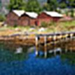
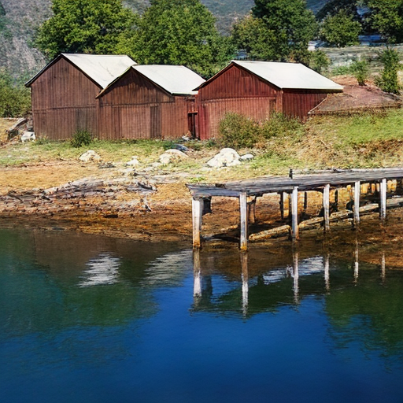
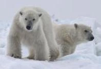

# Introduction
Diffusion-based image super-resolution (SR) methods have achieved remarkable success by leveraging large pre-trained text-to-image diffusion models as priors. [**S3Diff**](https://github.com/ArcticHare105/S3Diff) a novel one-step state-of-the-art SR model, which significantly addresses the efficiency issue of diffusion-based SR methods and exibits extraordinary performance.

However, when applying S3Diff to real production environments, we encountered the following problems:
- Unacceptable time consumption: The original S3Diff took 43 seconds to upscale an 2K image to 4K using A10.
- Unnecessary computation: After reviewing the original implementation of S3Diff, we found significant inefficient operations.

We optimize the implementation of S3Diff to avoid unnecessary calculation and H2D/D2H memory copy. Furthermore, lyraDiff is applied to accelerate the diffusion process. Compared to the original S3Diff, we reduces the generation time for 2K-4K image super-resolution by 83.27%, that is up to **6x acceleration**.

## Speed
### Test environment

- Device: Nvidia A10 / L20
- Nvidia driver version: 535.161.07
- Nvidia cuda version: 12.4
- Percision:fp16

### Performance
We evaluate the performance of lyraDiff and original S3Diff on both A10 and L20.   

#### A10 performance
| Image Size | SR Ratio | Time cost(s) (ori) | Time cost(s) (lyra) | Speed Up     |
|:----------:|:--------:|:------------------:|:-------------------:|:------------:|
| 128x128    | 4        | 0.68               | 0.17                | 4.0x         |
| 512x512    | 2        | 2.10               | 0.86                | 2.4x         |
| 720x1280   | 2        | 16.64              | 3.36                | 4.9x         |
| 1024x1024  | 2        | 19.90              | 3.75                | 5.3x         |
| 1920x1080  | 2        | 42.24              | 6.91                | 6.1x         |

#### L20 performance
| Image Size | SR Ratio | Time cost(s) (ori) | Time cost(s) (lyra) | Speed Up     |
|:----------:|:--------:|:------------------:|:-------------------:|:------------:|
| 128x128    | 4        | 0.47               | 0.10                | 4.7x         |
| 512x512    | 2        | 1.31               | 0.48                | 2.7x         |
| 720x1280   | 2        | 10.61              | 1.87                | 5.7x         |
| 1024x1024  | 2        | 12.23              | 2.07                | 5.9x         |
| 1920x1080  | 2        | 23.46              | 3.92                | 6.0x         |

## Usage

The example use tiling by default. Params `vae_encoder_tiled_size` and `vae_decoder_tiled_size` control tile size in vae encode/decode stage and use tiling or not. 

### Step1: Download the pretrained model weights
- SD-Turbo:  https://huggingface.co/stabilityai/sd-turbo
- S3Diff: https://huggingface.co/zhangap/S3Diff
### Step2: Run Example
``` python
python inference_s3.py
```

### Vision Compare
The following images of each examples are: 
- origin image
- SR image generated by S3Diff
- SR image generated by lyraDiff
#### example 1:   
<br>

<br>

#### example 2:
<br>

<br>

#### example 3:
<br>

<br>

